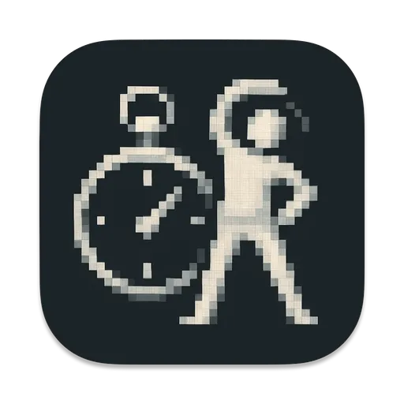

# Time to stretch

  

<h4 align="center">A customizable macOS menubar timer app designed to remind you to take breaks and stretch regularly.</h4>

  Inspired by the Pomodoro Technique, it helps you stay focused while maintaining your physical well-being.

## Features

- **Menubar-only Interface**: Clean, distraction-free timer that lives in your macOS menubar
- **Customizable Intervals**: Set your own focus and break durations (from 1 minute to 8 hours for focus, 1 minute to 1 hour for breaks)
- **Timer Presets**: Quick access to common timer configurations (Pomodoro, Short Work, Long Work)
- **Auto-cycle Mode**: Automatically loop through focus and break sessions indefinitely
- **Appearance Modes**: Choose between System, Light, or Dark appearance
- **Context Menu**: Right-click the menubar icon for quick access to timer controls and settings
- **Visual Feedback**: At-a-glance status from the menubar icon

## Screenshots

   
  <em>Time to stretch app in action</em>

### Settings Screens

   
  <em>App Configuration Settings</em>

   
  <em>Intervals Settings with Presets</em>

   
  <em>Keyboard Shortcuts Settings</em>

## Installation

1. Download the latest release from the [Releases](https://github.com/bohdanbirdie/time-to-stretch-app/releases) page
2. Move the app to your Applications folder
3. Launch the app

## Development

### Requirements

- macOS 14.0+

### Building from Source

1. Clone the repository
2. Open `Time to stretch.xcodeproj` in Xcode
3. Build and run the project

## License

This project is licensed under the [Creative Commons Attribution-NonCommercial 4.0 International License (CC BY-NC 4.0)](https://creativecommons.org/licenses/by-nc/4.0/).

This means you are free to:
- Share — copy and redistribute the material in any medium or format
- Adapt — remix, transform, and build upon the material

Under the following terms:
- Attribution — You must give appropriate credit, provide a link to the license, and indicate if changes were made.
- NonCommercial — You may not use the material for commercial purposes.
